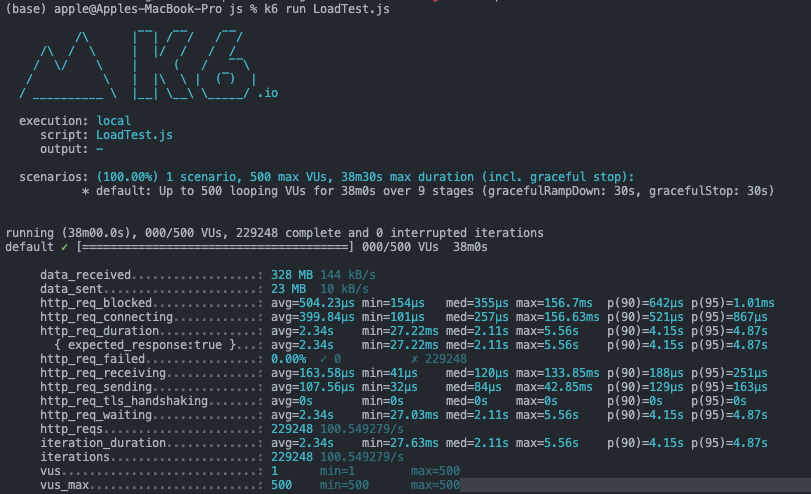

## Fabrick_task backend

### Installation
- Clone the git repo 
- Now run npm install (to install the packages and dependencies)
- Then run npm start(to start the app)

### API Endpoints

This App has one API end point to get and post 3d models

- /get     - to get all models
- /get/:id - to get model by id
- /post    - to post a model

### image storage
- All the 3d models are stored in cloudinary(free service for static data)
- And MongoDB is used fo the storage of image data ant cloudinary URL

### Load testing 
- used K6 to load test, handled 2lakh requests from 500 users in 38 min
